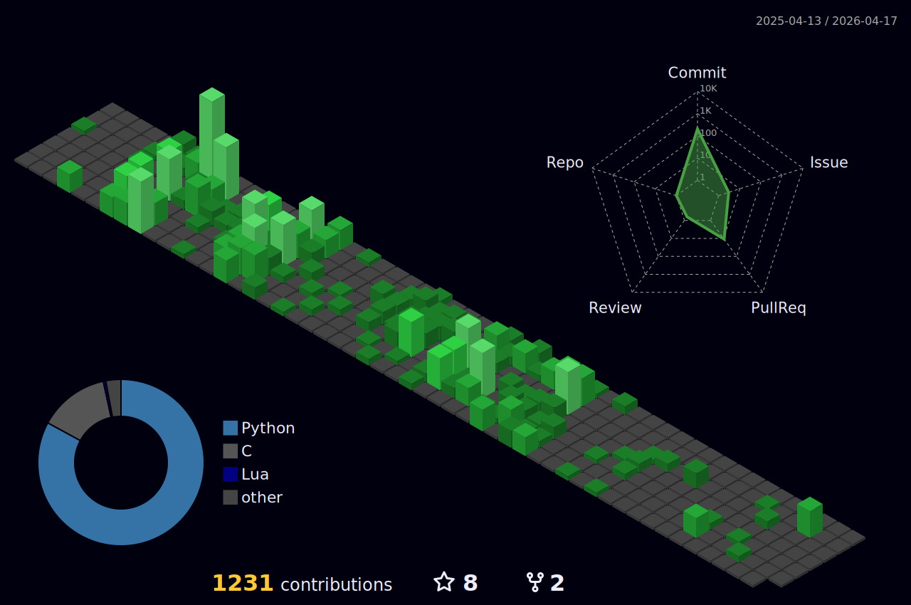

- 👋 Hi, I'm Alexandre - 👀 I'm interested in Python, JavaScript and Next.js - 🌱 I’m currently learning Django and a little bit about cybersecurity

 

  

  

###

###

 

<h1 align="center">Social Medias</h1>

###

  
  
 
  
  

###

###

  

###

<picture>
  <source media="(prefers-color-scheme: dark)" srcset="https://raw.githubusercontent.com/zander404/zander404/output/pacman-contribution-graph-dark.svg">
  <source media="(prefers-color-scheme: light)" srcset="https://raw.githubusercontent.com/zander404/zander404/output/pacman-contribution-graph.svg">
  
</picture>

###
